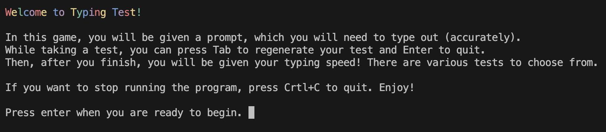
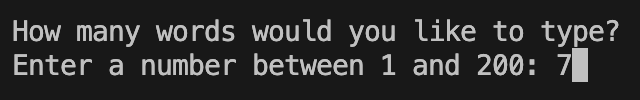
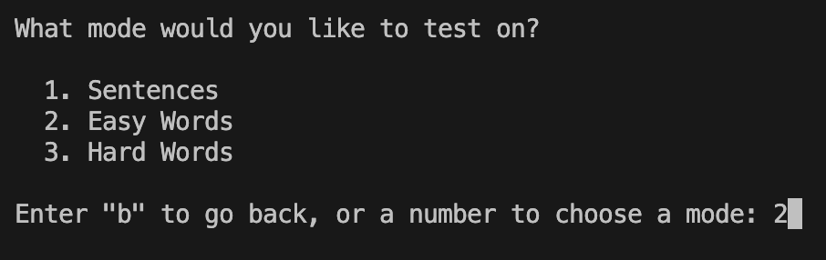
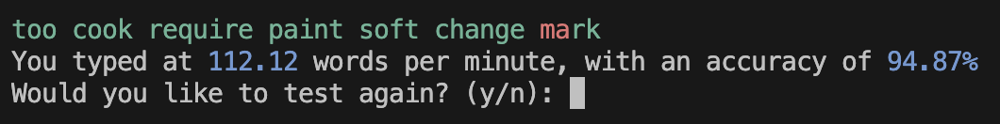

# Typing Test
A simple typing test you can do in your Python terminal!

## Setup
- Open a Python Enviromnent on VS Code
- Open a Python Terminal
- If not already, install necessary libaries using:
    ```
    $ pip install colorama
    $ pip install readchar
    ```
    - Other libraries, such as `os` and `time`, should already be on VS Code
- Run `main.py` and enjoy!

## Features
- Runs for as long as the player wants
- Special keybinds for restarting or quitting tests while taking one
    - `tab` to instantly regenerate
    - `enter` to quit the test
- Naviagteable settings pages
- Color-changing prompt, depending on what the player inputs
- Timing and WPM tracking
- Accuracy calculation
- Various methods to test

## Limitations
- Prompt sometimes flashes on screen as you type
- Backspace not working (for my terminal) - displays `^?`

## Datasets
- [AI Generated Essays](https://github.com/vivaansinghvi07/ai-essay-dataset) by me
- [1000 Most Common Words](https://gist.github.com/deekayen/4148741#file-1-1000-txt) by [@deekayen](https://gist.github.com/deekayen)
- English Word List from [gwicks.net](http://www.gwicks.net/dictionaries.htm)

## Usage
Here is an example run-through of what you'd see when playing (of course, given the navigation options it may not look exactly like this):







